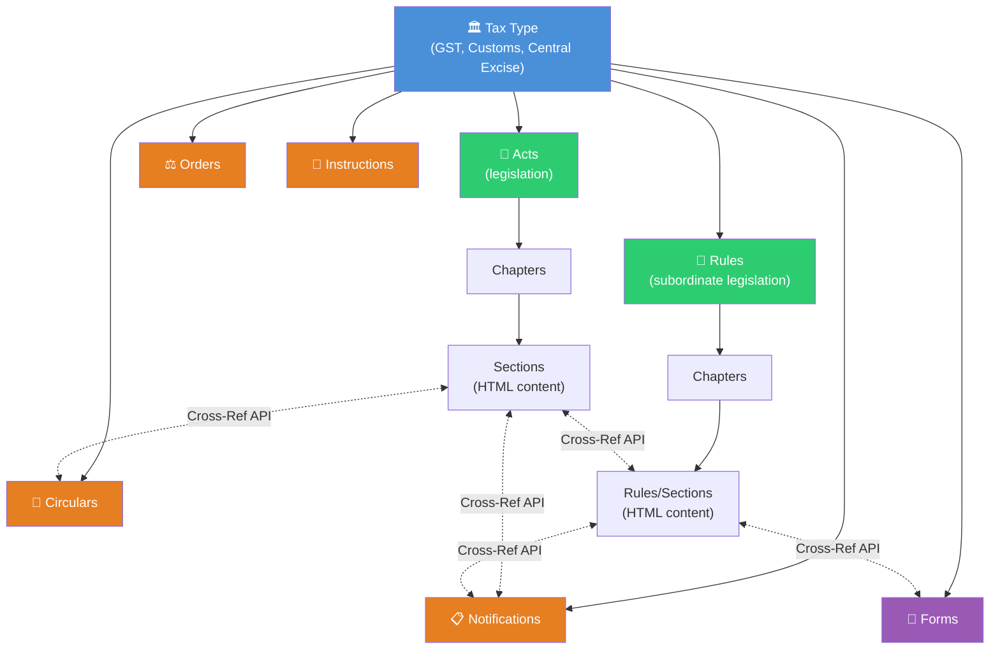

# CBIC Tax Information Portal — API Documentation

**Base URL:** `https://taxinformation.cbic.gov.in`  
**Authentication:** None required (public endpoints)  
**SSL:** Self-signed certificate (disable verification)  
**Last Updated:** March 14, 2026  

---

## Data Model Overview

The CBIC portal organizes Indian tax law into a **hierarchical graph** of interconnected document types. Every document is scoped under a **Tax Type** and linked to related documents via a **Cross-Reference API**.



### Content ID Prefixes

Every record has an `id` (primary key) and a `contentId` (used for cross-references). The contentId prefix identifies the document type:

| Prefix | Type | Example |
|---|---|---|
| `100` | Tax Type | `1001000001` (GST) |
| `110` | Act | `1101000006` (CGST Act) |
| `111` | Act Chapter | `1111000033` (Chapter V) |
| `112` | Act Section | `1121000285` (Section 16) |
| `120` | Rule Set | `1201000006` (CGST Rules) |
| `121` | Rule Chapter | `1211000010` |
| `122` | Rule Section | `1221000083` (Rule 3) |
| `150` | Notification | `1501010546` |
| `160` | Circular | — |

---

## 1. Tax Types

**Endpoint:** `GET /api/cbic-tax-msts`  
**Per tax:** `GET /api/cbic-tax-msts/{taxId}`

| ID | Tax Type |
|---|---|
| `1000001` | GST |
| `1000002` | Customs |
| `1000003` | Central Excise |
| `1000004` | Service Tax |
| `100005` | HSNS Cess |

---

## 2. Acts (Legislative Text)

Acts are structured as **Act → Chapters → Sections**, where each section has HTML content.

### 2.1 Act Metadata

**Endpoint:** `GET /api/cbic-act-msts/{id}`

```json
{
  "id": 1000006,
  "contentId": 1101000006,
  "actName": "Central Goods and Services Tax Act, 2017",
  "isActive": "Y",
  "taxId": {"id": 1000001},
  "contentFilePath": "tax_repository\\gst\\acts\\...pdf",
  "contentHtmlFilePath": "tax_repository\\gst\\acts\\...html"
}
```

**Discovery method:** Scan IDs 1000001–1000030. No bulk listing endpoint exists.

**GST Acts found (tax.id = 1000001):**

| ID | Act Name |
|---|---|
| 1000006 | Central Goods and Services Tax Act, 2017 |
| 1000015 | Integrated Goods And Services Tax Act, 2017 |
| 1000016 | Union Territory Goods And Services Tax Act, 2017 |
| 1000013 | Goods And Services Tax (Compensation To States) Act, 2017 |
| 1000012 | Constitution (One Hundred And First Amendment) Act, 2016 |
| 1000011 | CGST (Extension To Jammu And Kashmir) Act, 2017 |
| 1000014 | IGST (Extension To Jammu And Kashmir) Act, 2017 |
| 1000019 | CGST Amendment Act, 2023 |
| 1000020 | CGST (Second Amendment) Act, 2023 |
| 1000021 | IGST Amendment Act, 2023 |

### 2.2 Chapters

**Per chapter:** `GET /api/cbic-act-chapter-msts/getChapterName/{chapterId}`

```json
[{
  "id": 1000033,
  "contentId": 1111000033,
  "chapterNo": "Chapter V",
  "chapterName": "Input Tax Credit",
  "orderId": 5,
  "actId": {"id": 1000006},
  "taxId": {"id": 1000001}
}]
```

**Discovery method:** Scan chapter IDs (range ~1000025–1000100), filter by `actId`.

**CGST Act (ID 1000006): 22 chapters, 187 sections**

| Chapter | Name | Sections |
|---|---|---|
| I | Preliminary | 2 |
| II | Administration | 4 |
| III | Levy and Collection of Tax | 0 |
| IV | Time and Value of Supply | 4 |
| V | Input Tax Credit | 6 |
| VI | Registration | 9 |
| VII | Tax Invoice, Debit and Credit Notes | 5 |
| VIII | Accounts and Records | 2 |
| IX | Returns | 13 |
| X | Payment of Tax | 8 |
| XI | Refunds | 5 |
| XII | Assessment | 6 |
| XIII | Audit | 2 |
| XIV | Inspection, Search, Seizure and Arrest | 6 |
| XV | Demands and Recovery | 13 |
| XVI | Liability to pay in Certain Cases | 10 |
| XVII | Advance Ruling | 15 |
| XVIII | Appeals and Revision | 15 |
| XIX | Offences and Penalties | 20 |
| XX | Transitional Provisions | 4 |
| XXI | Miscellaneous | 35 |
| Schedule | — | 3 |

### 2.3 Sections

**By chapter:** `GET /api/cbic-act-section-msts/findByChapterId/{chapterId}`  
**By ID:** `GET /api/cbic-act-section-msts/viewSectionById/{sectionId}`

```json
[{
  "id": 1000285,
  "contentId": 1121000285,
  "sectionNo": "Section 16",
  "sectionName": "Eligibility and conditions for taking input tax credit",
  "contentFilePath": "tax_repository\\gst\\acts\\2017_CGST_act\\active\\chapter5\\section16_v1.00.html",
  "actId": {"id": 1000006},
  "chapterId": {"id": 1000033}
}]
```

### 2.4 Section HTML Content

**Endpoint:** `GET /content/html/{contentFilePath}`

Returns raw HTML with inline CSS. This is the **formatted legal text** exactly as it appears on the website — with provisos, explanations, amendments, tables, and cross-references.

---

## 3. Rules (Subordinate Legislation)

Rules follow the same hierarchical pattern as Acts, but use **bulk listing endpoints** instead of ID scanning.

### 3.1 List All Rule Sets

**Endpoint:** `GET /api/cbic-rule-msts/fetchRules/{taxId}`  
**Per rule:** `GET /api/cbic-rule-msts/{id}`

```json
[{
  "id": 1000006,
  "ruleDocName": "Central Goods and Services Tax Rules, 2017",
  "ruleCategory": "CGST Rules",
  "cbicTaxMst": {"id": 1000001},
  "contentFilePath": "...pdf",
  "contentHtmlFilePath": "...html"
}]
```

**GST Rule Sets (taxId=1000001): 10 total**

| ID | Rule Set |
|---|---|
| 1000006 | Central Goods and Services Tax Rules, 2017 |
| 1000028 | Integrated Goods and Services Tax Rules, 2017 |
| 1000029 | GST Compensation Cess Rules, 2017 |
| 1000030 | GST Settlement of Funds Rules, 2017 |
| 1000031 | UTGST (Lakshadweep) Rules, 2017 |
| 1000032 | UTGST (Daman and Diu) Rules, 2017 |
| 1000033 | UTGST (Dadra and Nagar Haveli) Rules, 2017 |
| 1000034 | UTGST (Chandigarh) Rules, 2017 |
| 1000035 | UTGST (Andaman and Nicobar Islands) Rules, 2017 |
| 1000091 | GST (Period of Levy and Collection of Cess) Rules, 2022 |

### 3.2 Rule Chapters

**Endpoint:** `GET /api/cbic-rule-chapter-msts/findChapterByRuleId/{ruleId}`

```json
[{
  "id": 1000011,
  "chapterNo": "Chapter I",
  "chapterName": "Preliminary",
  "cbicRuleMst": {"id": 1000006},
  "cbicTaxMst": {"id": 1000001}
}]
```

**CGST Rules (ID 1000006): 20 chapters** (Ch I–XIX + header)

### 3.3 Rule Sections

**By rule set (bulk):** `GET /api/cbic-rule-section-msts/findSectionByRuleId/{ruleId}`  
**By chapter:** `GET /api/cbic-rule-section-msts/findByChapterId/{chapterId}`

```json
[{
  "id": 1000083,
  "sectionNo": "Rule 3",
  "sectionName": "Composition Levy",
  "contentFilePath": "tax_repository/gst/rules/cgst_rules/active/chapter2/rule3_v1.00.html",
  "cbicRuleChapterMst": {"id": 1000012}
}]
```

HTML content is fetched the same way as Act sections: `GET /content/html/{contentFilePath}`

---

## 4. Notifications, Circulars, Orders, Instructions

These four document types share the **same API pattern**: individual metadata by ID + PDF download.

### Common Pattern

| Type | Metadata | Download | ID Range |
|---|---|---|---|
| Notifications | `GET /api/cbic-notification-msts/{id}` | `.../download/{id}/{lang}` | 1M–10.6K |
| Circulars | `GET /api/cbic-circular-msts/{id}` | `.../download/{id}/{lang}` | 1M–4K |
| Orders | `GET /api/cbic-order-msts/{id}` | `.../download/{id}/{lang}` | 1M–5K |
| Instructions | `GET /api/cbic-instruction-msts/{id}` | `.../download/{id}/{lang}` | 1M–5K |

**Language codes:** `ENG`, `HINDI`

**Discovery method:** Sequential ID scan. Each ID returns either the record (200) or 404. Records contain a `tax.id` field used to filter by tax type.

### Notification Metadata (representative for all 4 types)

```json
{
  "id": 1010546,
  "contentId": 1501010546,
  "notificationNo": "20/2025-Central Tax",
  "notificationName": "Seeks to notify CGST (Fifth Amendment) Rules, 2025",
  "notificationCategory": "Central Tax",
  "notificationDt": "2025-12-31T05:30:00+05:30",
  "docFileName": "20-2025-ct.pdf",
  "docFileNameHi": "20-2025h-ct.pdf",
  "tax": {"id": 1000001},
  "isAmended": "",
  "parentId": null
}
```

### PDF Download

```json
{"data": "JVBERi0xLjc..."}  // base64-encoded PDF
```

Decode with `base64.b64decode(response["data"])`.

> [!NOTE]
> Hindi PDFs frequently return HTTP 500 (server-side issue, not all Hindi versions exist).

---

## 5. Forms

Forms use a **bulk fetch pattern** — no ID scanning needed.

**List all forms:** `GET /api/cbic-form-msts/fetchForms/{taxId}`  
**List categories:** `GET /api/cbic-form-msts/fetchFormsCategory/{taxId}`  
**Filter by category:** `GET /api/cbic-form-msts/findFormByFormCategory/{taxId}/{category}`  
**Download PDF:** `GET /api/cbic-form-msts/download/{id}`

Download response includes the filename: `{"data": "base64...", "fileName": "FORM GST CMP-01.pdf"}`

> [!WARNING]
> Some forms return empty `fileName`. Implement fallback naming (e.g., `form_{id}.pdf`).

**GST Forms:** 197 forms across 21 categories.

---

## 6. Cross-Reference API ⭐

The most powerful feature — links **every document type to every other** via a unified graph.

### 6.1 Get Related Content Counts

**Endpoint:** `GET /api/cbic-content-maps/get-related-content/{docType}/{contentId}`

| docType | Used for |
|---|---|
| `Acts` | Act sections |
| `Rules` | Rule sections |
| `Notification` | Notifications |
| `Circular` | Circulars |

```json
// GET /api/cbic-content-maps/get-related-content/Acts/1121000285
// (Section 16 of CGST Act)
[{"relatedTabName": "Rule", "count": 14, "relatedContent": "RULE"}]
```

```json
// GET /api/cbic-content-maps/get-related-content/Rules/1221000083
// (Rule 3 of CGST Rules)
[
  {"relatedTabName": "Act", "count": 1, "relatedContent": "ACT"},
  {"relatedTabName": "Form", "count": 6, "relatedContent": "FORM"}
]
```

### 6.2 Get Related Content Details

**Endpoint:** `POST /api/cbic-content-maps/fetch-related-content`

```json
// Request body
{
  "parentContentCategory": "RULE",
  "parentContentId": 1121000285
}
```

**`parentContentCategory` values:** `"ACT"`, `"RULE"`, `"NOTIFICATION"`, `"CIRCULAR"`, `"FORM"`

**Response:**
```json
{
  "actSectionMsts": null,
  "ruleSectionMsts": [
    {
      "taxType": "GST",
      "ruleName": "Central Goods and Services Tax Rules, 2017",
      "ruleSubjectName": "Rule 21 - Registration to be cancelled in certain cases",
      "taxId": 1000001,
      "ruleId": 1000103
    }
    // ... 14 items for Section 16
  ],
  "regulationMsts": null,
  "formMsts": null,
  "notificationMsts": null,
  "circularMsts": null
}
```

### 6.3 Cross-Reference Graph

This creates a bidirectional link graph across the entire tax database:

```
Section 16 (ITC eligibility)
  ├── 14 related Rules (Rule 36, 37, 42, 43, etc.)
  └── N related Notifications

Rule 3 (Composition Levy)
  ├── 1 related Act section
  └── 6 related Forms
```

**Usage:** For any `contentId`, you can discover all related documents across every type — enabling compliance mapping, impact analysis, and legal research.

---

## 7. Discovery Patterns

The CBIC API uses two different patterns depending on the data type:

### Pattern A: Sequential ID Scanning

**Used by:** Notifications, Circulars, Orders, Instructions, Act chapters

Scan IDs from `1000001` upward. Each ID returns a record (200) or 404.
- Filter by `tax.id` for specific tax types
- IDs are **not sequential** by date or type — mixed across all taxes

### Pattern B: Bulk Fetch

**Used by:** Forms, Rule sets, Rule sections, Rule chapters

A single API call returns all records for a tax type or parent entity.
- `fetchForms/{taxId}` — all forms
- `fetchRules/{taxId}` — all rule sets
- `findSectionByRuleId/{ruleId}` — all rules in a set
- `findChapterByRuleId/{ruleId}` — all chapters in a set
- `findByChapterId/{chapterId}` — all sections in a chapter

---

## Implementation Notes

### SSL/TLS
```python
# aiohttp
ssl_context = ssl.create_default_context()
ssl_context.check_hostname = False
ssl_context.verify_mode = ssl.CERT_NONE

# requests
requests.get(url, verify=False)
```

### Rate Limiting
- No documented limits
- Recommended: 5–10 concurrent connections, 1s batch delays
- Full notification scan (~10K IDs): ~18–20 minutes

### Known Issues
- Hindi PDFs frequently return HTTP 500
- Some forms return empty `fileName` on download
- 1 orphan form record (ID 1000379) returns 500
- `findByActId` is **not** a valid endpoint (returns Angular app HTML)
- Some Act/Rule chapter IDs are non-sequential

---

## Data Collection Statistics

**Total Documents Indexed:** 11,855+

| Data Type | Count | Method | Content |
|---|---|---|---|
| GST Notifications | 1,281 | ID scan | PDF |
| GST Circulars | 271 | ID scan | PDF |
| GST Orders | 39 | ID scan | PDF |
| GST Instructions | 42 | ID scan | PDF |
| GST Forms | 197 | Bulk API | PDF |
| GST Acts | 10 acts, 187+ sections | ID scan + hierarchy | HTML |
| GST Rules | 10 sets, 160+ rules | Bulk API | HTML |
| Customs Notifications | 6,872 | ID scan | PDF |
| Customs Circulars | 1,760 | ID scan | PDF |
| Customs Instructions | 393 | ID scan | PDF |

---

## Changelog

**v2.0 - March 14, 2026**
- Complete rewrite with data model overview and interconnection graph
- Added Acts API (metadata, chapters, sections, HTML content)
- Added Rules API (bulk fetch, chapters, sections)
- Added Cross-Reference API (`get-related-content`, `fetch-related-content`)
- Documented Content ID prefix system
- Added discovery patterns (ID scan vs bulk fetch)
- Consolidated Notifications/Circulars/Orders/Instructions as common pattern

**v1.2 - March 14, 2026**
- Added Orders, Instructions, Forms endpoints

**v1.1 - March 13, 2026**
- Added Hindi PDF download, Hindi-only notifications

**v1.0 - March 13, 2026**
- Initial documentation (Notifications + PDF download)

---

**Disclaimer:** Based on reverse engineering of public endpoints. CBIC may change APIs without notice.
